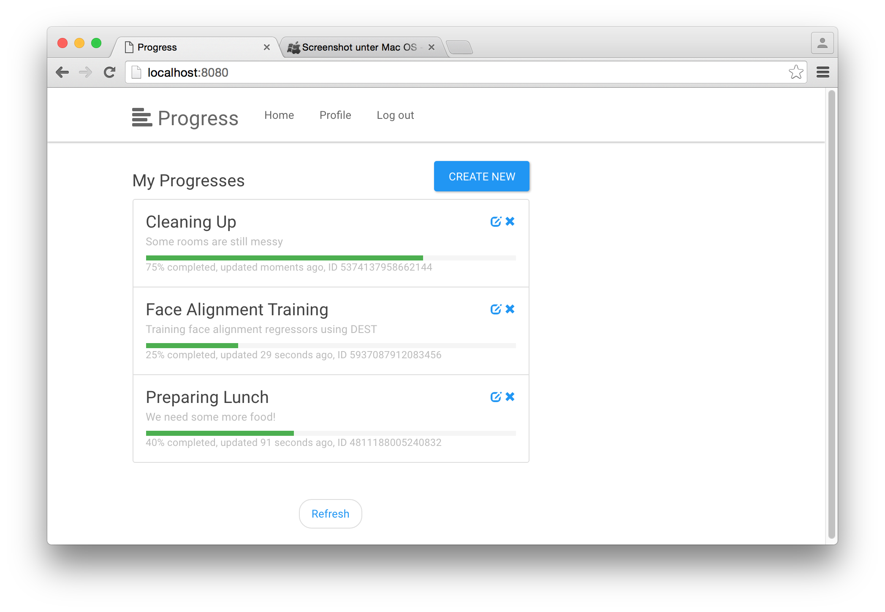

## What it does
**gae-progress** is a [Google App Engine](https://cloud.google.com/appengine/) (GAE) project managing arbitrary progresses written mainly in Python. It is meant for people getting started with GAE and [PaaS](https://en.wikipedia.org/wiki/Platform_as_a_service).

Test the [live demo](https://progress-1181.appspot.com).

## What's in it

All the features at a glance:
  - Create, update, delete and query progresses.
  - User authentication / authorization using [OpenID Connect](https://developers.google.com/identity/protocols/OpenIDConnect) or alternatively using API keys.
  - Query pagination using cursors.
  - Clients using [Google APIs client library](https://developers.google.com/discovery/libraries) (Python, Javascript and Java).

The project is structured as follows:
  - the `backend` directory contains files making up the application that runs on GAE. It consists of
    - `backend/progress` a RESTful API for managing progresses based [Google Endpoints API](https://cloud.google.com/appengine/docs/python/endpoints/)
    - `backend/www` a set of static webpages served to rich web clients
  - the `clients` directory contains additional clients utilizing the progress API.
