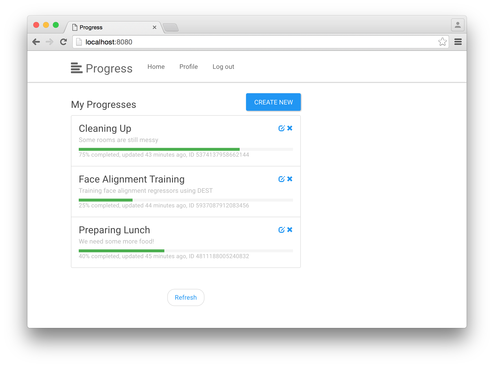

## What it does
**gae-progress** is a [Google App Engine](https://cloud.google.com/appengine/) (GAE) project managing arbitrary progresses. It is meant for people getting started with GAE and [PaaS](https://en.wikipedia.org/wiki/Platform_as_a_service).


Test the [live demo](https://progress-1181.appspot.com).

## What's in it

The features at a glance:
  - RESTful web service
    - to create, update, delete and query progresses,
    - implemented using [Google Endpoints API](https://cloud.google.com/appengine/docs/python/endpoints/),
    - supporting user authentication / authorization using [OpenID Connect](https://developers.google.com/identity/protocols/OpenIDConnect) or by API keys.
  - Web app build with [AngularJS](https://angularjs.org/).
  - Additional clients using [Google APIs client library](https://developers.google.com/discovery/libraries) (Python, Javascript and Java).

## Structure

The project is structured as follows:
  - the `backend` directory contains files making up the application that runs on GAE. It consists of
    - `backend/progress` a RESTful service for managing progresses based [Google Endpoints API](https://cloud.google.com/appengine/docs/python/endpoints/)
    - `backend/www` a web app to access and manage progresses
  - the `clients` directory contains additional clients utilizing the progress API.

## Getting started

A couple of steps are required in order to run this backend service under your Google account.

#### Create a new GAE project

Open the [Google Developer Console](https://console.developers.google.com), click on *Create a project* and write down its `Project-ID`.

#### Set up credentials

Next, you need to create new credentials for OAuth (OpenID connect) support. This will be needed so users can authenticate with our progress API via the web app. Here are the steps.

  1. In the developer console navigate open *API Manager/Credentials* and create a new *OAuth client ID* credential.
  1. Select *Web application*.
  1. In *Authorized Javascript Origins* add `http://localhost:8080` and `https://Project-ID.appspot.com`.
  1. In *Authorized redirect URIs* add `http://localhost:8080/oauth2callback` and `https://Project-ID.appspot.com/oauth2callback`.
  1. Write down the generated `Client-ID`.
  1. In *API Manager/Credentials* create a *OAuth Consent Screen*. Default values are ok.

If you are feeling lost, more info on this process can be found [here](https://cloud.google.com/appengine/docs/python/endpoints/auth#Python_Creating_OAuth_20_client_IDs).

#### Get the source code
Fork or download a [release](/releases) of this repository. Update the source using your `Client-ID` and `Project-ID` values.

  - In `backend/app.yaml` update `application: Project-ID`
  - In `backend/progress/constants.py` update `WEB_CLIENT_ID = 'Client-ID'`
  - In `backend/www/js/app.js` update `CLIENT_ID: 'Client-ID'`

#### Start the development server

Install the [Google App Engine SDK for Python](https://cloud.google.com/appengine/downloads#Google_App_Engine_SDK_for_Python). At the time of writing the 1.9.30 was the most recent version. Navigate to the `backend` directory and run

```
> devappserver.py .
```

from the command line. If all goes well you should be able to access `http://localhost:8080` and see welcome message similar to:


If you cannot access the service, make you don't spot any errors in the console log. If you have multiple GAE instances running locally, check which port was bound by the server. Browsing the output you should see something along the lines of:
```
Starting module "default" running at: http://localhost:8080
```

## API design

Once the backend server is up and running you can explore the API using Google API Explorer. It's accessible from `http://localhost:8080/_ah/api/explorer`. Alternatively you can browse the [live API](https://progress-1181.appspot.com/_ah/api/explorer).


#### Methods
The `progressApi` provides the following methods
  - `create`, `update`, `delete` for modifying progresses.
  - `list` for querying progresses.
  - `userProfile`, `generateNewApiKey` for managing user related properties.

#### Entities

From a database perspective `progressApi` modifies two kinds of entities: `User` and `Progress`. The `User` entity holds sensitive user information such as E-Mail address and API key.
```python
class User(ndb.Model):
    email = ndb.StringProperty()
    apikey = ndb.StringProperty()
```

The `Progress` entity stores information on individual progresses.
```python
class Progress(ndb.Model):
    title = ndb.StringProperty()
    description = ndb.StringProperty()
    progress = ndb.FloatProperty(default=0.0)
    created = ndb.DateTimeProperty(auto_now_add=True)
    lastUpdated = ndb.DateTimeProperty(auto_now=True)
```

#### Keys

We will use the MD5 hashed E-Mail address as the key for `User`. Although this bears the small chance of generating duplicate keys, it provides some benefits when dealing with API keys as we will see in the [Authentication](#Authentication) section. Also note, the OpenID Connect protocol provides a unique user id that could be used instead.

We let the datastore automatically generate unique ids used as keys for `Progress` entities. As progresses are created by specific users, we require that a `Progress` key needs to have a `User` key as parent (see [ancestor relationship](https://cloud.google.com/appengine/docs/python/ndb/entities) for more info). `Progress` IDs generated by the datastore will only be unique in the context of a parent `User` key.

#### Messages
Each method provided by `progressApi` requires request and response messages. In Google Endpoints these are modelled using [Google Protocol Buffers](https://developers.google.com/protocol-buffers/), a framework that provides flexible message serialization in multiple languages. All messages can be found in [models.py](backend/progress/models.py).


#### Authentication <a name="Authentication"></a>

`progressApi` supports OpenID Connect for user authentication. Once a user authenticates, the user is fetched from the known `User` entities. If the user is not found in the datastore, a new `User` will be created on the fly. This way, sign up and sign in are actually one step.

There are a number of steps involved in authentication via OpenID Connect, a fact that could throw of users from using your API as developing clients becomes too complex. As a consequence each `User` is also assigned an API key that can be used as an alternative way of authentication.

The API key is randomly generated id that can be passed along with each `progressApi` request. When the backend API detects that an API key is present on a request, it looks up the corresponding `User` and verifies that the two API keys match.

The API key is a string assembled from two parts: `User-UUID`. The former part is the MD5 hashed E-Mail address of the user and the latter part is a [Universally unique identifier](https://en.wikipedia.org/wiki/Universally_unique_identifier). Encoding the user information in the API key has the advantage to be able to directly lookup the `User` entity via it's key, compared to a costly query.

The responsible function for looking up users from OpenID Connect or API keys is `getUser` in [api.py](backend/progress/api.py).

#### Authorization

Authenticated users (either via OpenID Connect or API key) are authorized to create new progresses and manipulate their own progresses.

## Clients
Besides the web app that runs in the clients browser, this project comes with a set of additional clients that talk to our `progressApi`.

#### Web app <a name="WebApp">
The web app runs in the clients browser. Web pages are served from the development / live server. These pages are static but contain [AngularJS](https://angularjs.org/) logic that is being evaluated on the client side. This logic accesses the `progressApi` through  [Google APIs client library](https://developers.google.com/discovery/libraries) in JavaScript.

The web app supports full user management and progress management. Note that `progressApi` creates new users only from OpenID Connect authentication. Before using any other API key based client you therefore need sign in once using the web app.

Browse [`backend/www`](backend/www) for more information. Try the [live demo](https://progress-1181.appspot.com).

#### Python-gapi client

This client uses [Google APIs client library](https://developers.google.com/discovery/libraries) to access `progressApi` from a python script.

To use the client you need to supply your API key. An API key is generated automatically for your when you first sign in to the web app. See the [web app](#WebApp) section for details. You can find and update your API key in the `Profile`.

To create a new progress navigate to `clients/python-gapi`
```
> python progress.py create --key YOURAPIKEY --name 'Progress title'
```

When successfuly you should receive the ID of the newly generated `Progress`.

```
{u'id': u'5953992903360512'}
```

By default the client assumes the development server runs at `http://localhost:8080`. For more help on parameters and commands type

```
> python progress.py -h
```

## License
```
Copyright Christoph Heindl 2016

gae-progress is free software: you can redistribute it and/or modify
it under the terms of the GNU General Public License as published by
the Free Software Foundation, either version 3 of the License, or
(at your option) any later version.

gae-progress is distributed in the hope that it will be useful,
but WITHOUT ANY WARRANTY; without even the implied warranty of
MERCHANTABILITY or FITNESS FOR A PARTICULAR PURPOSE.  See the
GNU General Public License for more details.

You should have received a copy of the GNU General Public License
along with gae-progress. If not, see <http://www.gnu.org/licenses/>.
```
